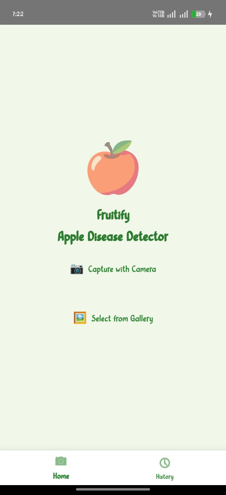
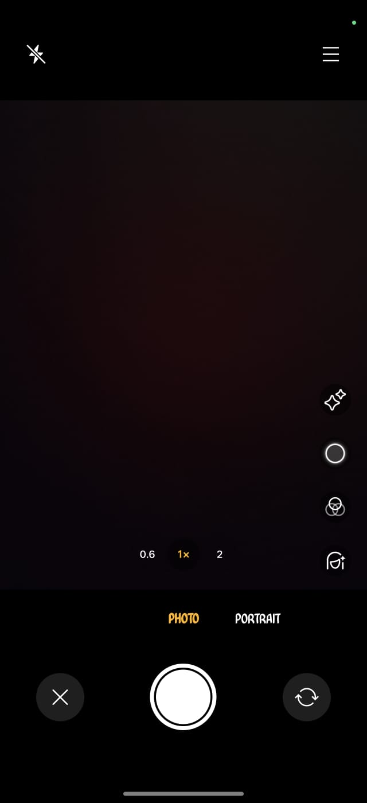
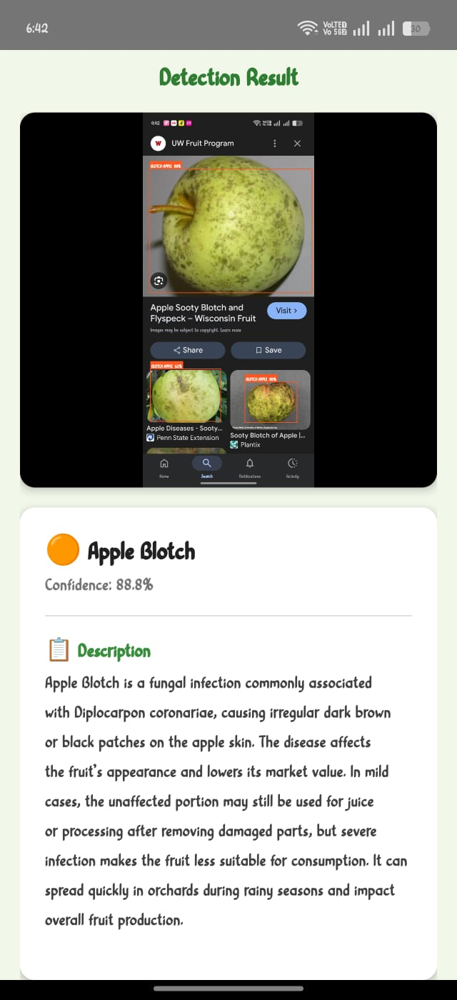
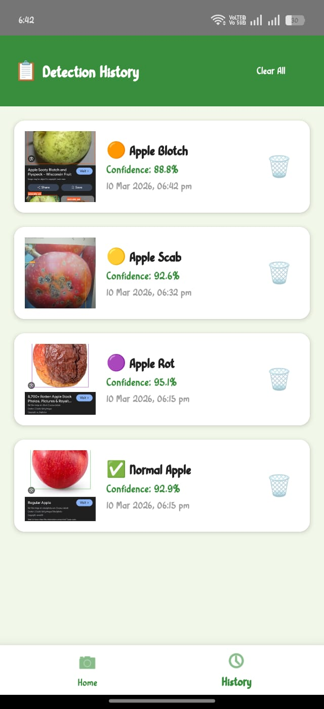

# 🍎 Fruitify — AI-Powered Fruit Quality Detection App


> An AI-based Android mobile application that detects apple fruit quality in real-time using YOLOv8 and TensorFlow Lite — classifying fruits as **Normal**, **Rot**, **Scab**, or **Blotch** with bounding boxes and confidence scores.

---

## 📱 App Screenshots


| Home | Camera |
|:----:|:------:|
|  |  | 

| Result | History |
|:-------:|:-------:|
|  |  |
---

## ✨ Features

- 🔍 **Real-Time Detection** — Detect fruit quality in 2–4 seconds
- 📷 **Camera & Gallery** — Capture live photo or pick from gallery
- 🎯 **Bounding Boxes** — Color-coded boxes with confidence score
- 📋 **Disease Info Card** — Detailed description of detected condition
- 🗂️ **Detection History** — All past scans saved in local Room Database
- 📴 **Offline Support** — TFLite on-device inference, no internet needed
- 🗑️ **Clear History** — Delete individual or all history records

---

## 🍎 Detection Classes

| Class | Label | Description |
|-------|-------|-------------|
| ✅ Normal Apple | `normal_apple` | Healthy fruit, safe to eat |
| 🟠 Apple Blotch | `blotch_apple` | Fungal infection — dark brown/black patches |
| 🟣 Apple Rot | `rot_apple` | Botryosphaeria obtusa — mushy, unsafe to eat |
| 🟡 Apple Scab | `scab_apple` | Venturia inaequalis — dark rough cracked spots |

---

## 🛠️ Tech Stack

### Android App
| Technology | Version | Purpose |
|------------|---------|---------|
| Java | - | App development language |
| Android Studio | Hedgehog | IDE |
| TensorFlow Lite | 2.14.0 | On-device AI inference |
| YOLOv8m | - | Object detection model |
| Room Database | 2.6.1 | Local history storage |
| Material Design | 1.11.0 | UI components |
| RecyclerView | 1.3.2 | History list display |

### Model Training
| Technology | Purpose |
|------------|---------|
| Python + Ultralytics | YOLOv8 training |
| Google Colab | Training environment |
| Label Studio | Dataset annotation |
| OpenCV | Image preprocessing |


---

## 📁 Project Structure

```
Fruitify/
│
├── app/
│   ├── src/main/
│   │   ├── java/com/example/appledisease/
│   │   │   ├── MainActivity.java           # Bottom navigation container
│   │   │   ├── HomeFragment.java           # Camera + Gallery buttons
│   │   │   ├── ResultActivity.java         # Detection result display
│   │   │   ├── ResultDetailActivity.java   # History item detail view
│   │   │   ├── AppleDetector.java          # TFLite inference engine
│   │   │   ├── BoundingBoxDrawer.java      # Draw colored boxes
│   │   │   ├── DiseaseInfo.java            # Disease descriptions
│   │   │   ├── DetectionHistory.java       # Room DB entity
│   │   │   ├── HistoryDao.java             # Room DB queries
│   │   │   ├── AppDatabase.java            # Room DB singleton
│   │   │   ├── HistoryAdapter.java         # RecyclerView adapter
│   │   │   └── HistoryFragment.java        # History list screen
│   │   │
│   │   ├── assets/
│   │   │   └── best.tflite                 # YOLOv8 TFLite model (add manually)
│   │   │
│   │   └── res/
│   │       ├── layout/
│   │       │   ├── activity_main.xml
│   │       │   ├── fragment_home.xml
│   │       │   ├── activity_result.xml
│   │       │   ├── activity_result_detail.xml
│   │       │   ├── fragment_history.xml
│   │       │   └── item_history.xml
│   │       ├── menu/
│   │       │   └── bottom_nav_menu.xml
│   │       └── xml/
│   │           └── file_paths.xml
│   │
│   └── build.gradle
│
├── flask_app/
│   ├── app.py                              # Flask web application
│   ├── templates/
│   │   └── index.html
│   └── static/
│
├── model_training/
│   ├── train.py                            # YOLOv8 training script
│   ├── data.yaml                           # Dataset config
│   └── export_tflite.py                    # TFLite export script
│
├── build.gradle
├── settings.gradle
└── README.md
```

---

## ⚙️ Setup & Installation

### Prerequisites
- Android Studio (Hedgehog or higher)
- Android device with Android 8.0+ (Min SDK 24)
- JDK 17 (Embedded in Android Studio)

### Steps

**1. Clone the repository**
```bash
git clone https://github.com/yourusername/Fruitify.git
cd Fruitify
```

**2. Open in Android Studio**
```
File → Open → Select Fruitify folder
```

**3. Add TFLite Model**
```
- Create assets folder: app/src/main → New → Folder → Assets Folder
- Copy best.tflite to: app/src/main/assets/best.tflite
```

**4. Sync & Run**
```
Click "Sync Project with Gradle Files"
Run on device or emulator
```
---

## 🙏 Acknowledgements

- [Ultralytics YOLOv8](https://github.com/ultralytics/ultralytics)
- [TensorFlow Lite](https://www.tensorflow.org/lite)
- [Label Studio](https://labelstud.io)
- [Android Room Database](https://developer.android.com/training/data-storage/room)

---

⭐ **If you found this project helpful, please give it a star!** ⭐
